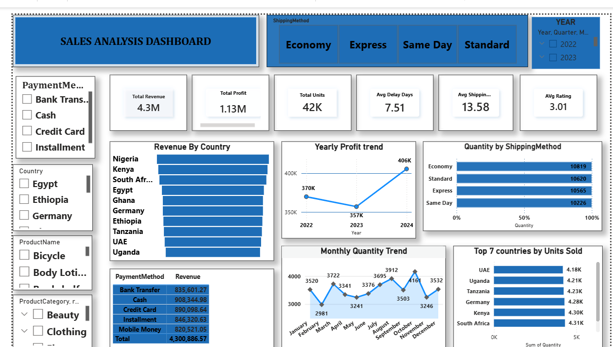
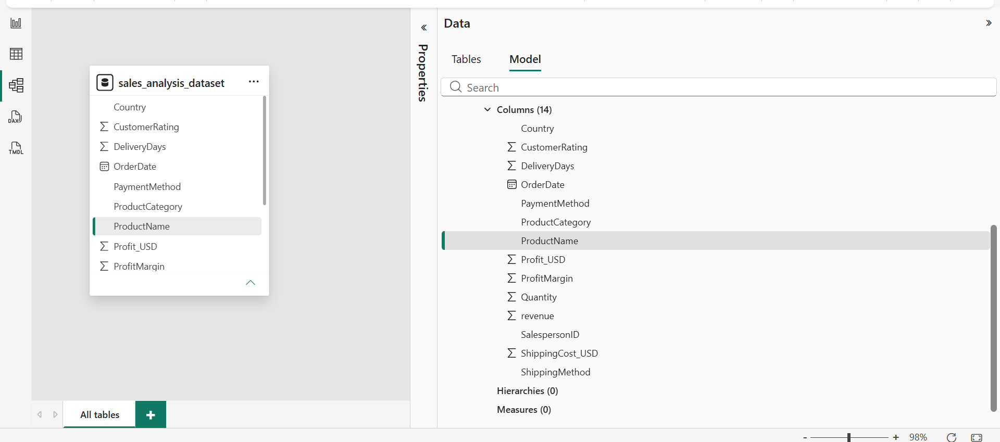
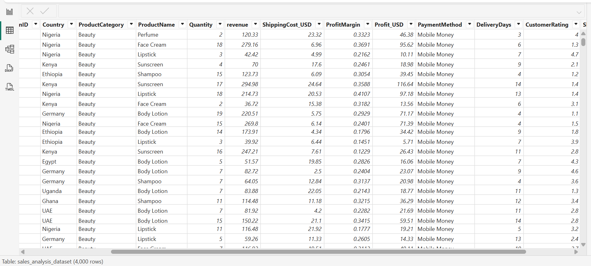

# Sales Analysis Dashboard

## Project Overview

This project is an interactive Power BI dashboard developed to analyze sales performance across different countries, products, payment methods, and shipping methods.

The dashboard helps identify trends in revenue, profit, customer ratings, shipping performance, and product sales to support business decision-making.

---

## Dashboard Preview

### Dashboard

---

### Data Model

---

### Data Table

---

## Features

- Revenue Analysis
- Profit Analysis
- Quantity Sold Analysis
- Country Performance
- Shipping Method Comparison
- Monthly Sales Trend
- Payment Method Analysis
- Interactive Filters (Slicers)

---

## KPIs

- Total Revenue
- Total Profit
- Total Quantity Sold
- Average Delivery Days
- Average Shipping Cost
- Average Customer Rating

---

## Tools Used

- Power BI
- Power Query
- DAX
- Data Modeling
- CSV Dataset

---

## Files Included

- Sales Analysis 1 Dashboard.pbix
- sales_analysis_dataset.csv
- Bi Dashboard.png
- model.png
- Table.png

---

## Business Insight

- The business recorded a total revenue of **$4.30M** and a total profit of **$1.13M**, indicating strong overall business performance.
- More than **42K units** were sold across all markets during the analysis period.
- Nigeria, Kenya, South Africa, Egypt, and Ghana are among the top revenue-generating countries.
- Sales volume varies throughout the year, with October recording one of the highest quantities sold.
- All four shipping methods contribute almost equally to total quantity sold, suggesting balanced customer usage.
- The average delivery time is **7.51 days**, while the average shipping cost is **13.58**.
- The average customer rating is **3.01/5**, indicating an opportunity to improve customer satisfaction.
- Multiple payment methods contribute significantly to revenue, showing customers prefer flexible payment options.

---

## Recommendations

- Focus marketing efforts on the highest-performing countries to maximize revenue.
- Investigate the reasons behind the average customer rating and improve customer experience.
- Analyze the factors driving higher sales in peak months and apply similar strategies during slower periods.
- Monitor shipping efficiency to reduce delivery times without increasing shipping costs.
- Continue supporting multiple payment methods to enhance customer convenience.
The dashboard enables users to:

- Identify top-performing countries.
- Compare shipping methods.
- Monitor monthly sales trends.
- Evaluate payment method performance.
- Track revenue and profitability.
- Analyze customer purchasing patterns.

---

## Author

**Kiprotich Tonny**

Data Analytics | Power BI | SQL | Excel | Python
